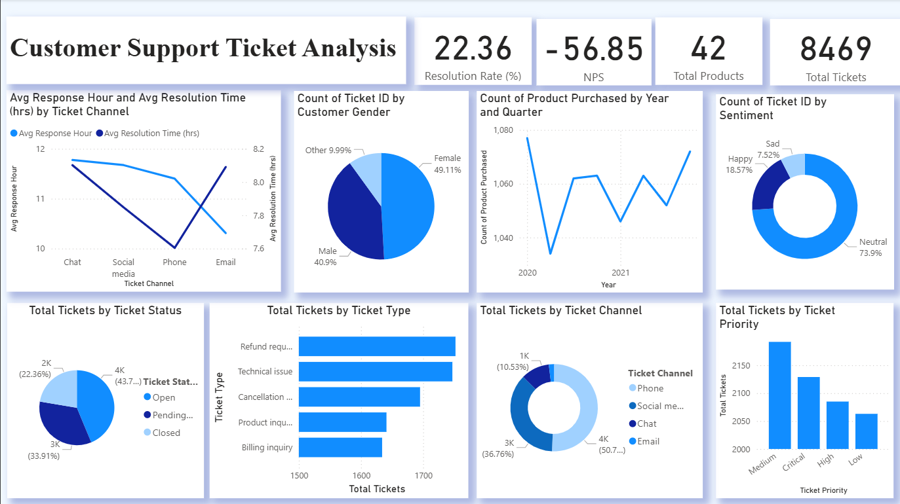

<body style="font-family: Arial, sans-serif; line-height: 1.6; max-width: 900px; margin: 2rem auto; color: #333;">

  <h1>Customer Support Performance Dashboard – Power BI</h1>

  <h2> Overview</h2>
  
This Power BI dashboard provides comprehensive insights into the performance of a customer support system. It leverages real-world ticket data to track key performance indicators (KPIs), identify operational bottlenecks, and highlight customer sentiment trends for data-driven decision-making.

  <h2> Objectives</h2>
  <ul>
    <li>Monitor key customer service KPIs such as resolution rate, average response time, and NPS.</li>
    <li>Visualize support efficiency by ticket priority, channel, and sentiment.</li>
    <li>Segment customer feedback into Happy, Neutral, and Sad for actionable insights.</li>
    <li>Enable managers and stakeholders to drill down into operational metrics interactively.</li>
  </ul>

  <h2> Key Features</h2>
  <ul>
    <li><strong>Resolution Rate (%):</strong> Percentage of tickets successfully closed.</li>
    <li><strong>Average First Response Time:</strong> Measures responsiveness by hour of first reply.</li>
    <li><strong>Average Resolution Time:</strong> Time between first response and resolution, with error-handling for reversed timestamps.</li>
    <li><strong>NPS (Net Promoter Score):</strong> Based on customer satisfaction ratings categorized into Promoters, Passives, and Detractors.</li>
    <li><strong>Sentiment Analysis:</strong> Pre-processed labels (Happy, Neutral, Sad) with ticket count visualization.</li>
    <li><strong>Breakdowns by Priority & Channel:</strong> KPI comparison across ticket categories and support modes.</li>
    <li><strong>Interactive Filters:</strong> Slice dashboard by sentiment, ticket type, channel, or customer demographic.</li>
  </ul>
